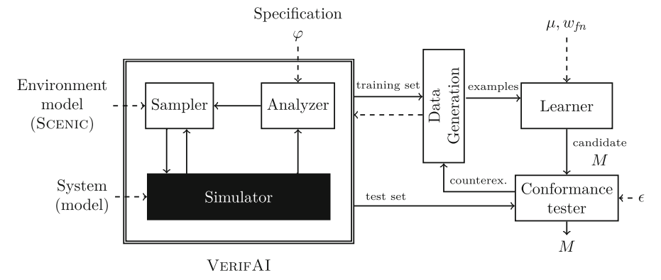

# MODD

The MODD class receives a set of labeled traces and outputs a ODD Monitor. It implements the boxes on the right side of the following diagram:

## VerifAI Interface 

Given a specification $\varphi$, VerifAI uses the sampler, analyzer and simulator to generate a set of traces $\{\sigma_i, \ell_i\}_i$.

The MODD class receives the set of evaluated simulation traces  $\{\sigma_i\}_i$, where each point $\sigma_i$ is defined by a features vector and a special feature namely the correctness of the specification, and generates a training dataset $\{\tau_i, \ell_i\}_i$, where $\tau_i$ is a vector and $\ell_i$ is a single value (Data Generation box in the diagram).

The MODD class uses then the training dataset $\{\tau_i, \ell_i'\}_i$ to train a monitor $M$ (Learner box).

The MODD class evaluates the monitor $M$ over some new simulations (Evaluation box). If the optimality objective is not met, the MODD will trigger the generation of new simulations to expand the training dataset and restart the training process.  

### Implementation details

The MODD receives the following inputs:
- datagen_params: Parameters required to generate the training dataset:
    - preprocessing function 
    - labeling function
    - saving directory
- trainer_params: Parameters required to train the ODD Monitor:
    - model to be trained (sklearn, pytorch, etc.)
    - training results saving directory
    - trained model saving path
- eval_params: Parameters required to evaluate the ODD Monitor:
    - evaluation method
    - specification
    - number of simulations to run
    - number of steps per simulation
    - evaluation results saving directory
    - evaluation results of running the monitor on simulations
    - evaluation results of running the system without the monitor on the same simulations
    - scenes saving path
- sampling_params: Parameters required to specify how to make calls to a sampler to generate more data:
    - sampler 
    - server_class
    - server_options
    - path to controller to be monitored
- global_params: Parameters to specify how many simulations to run per loop of the MODD generation process:
    - initial number of simulations
    - initial number of simulation steps
    - number of simulations per refinement loop
    - number of steps per refinement simulation
    - iterations of the refinement loop

    

## Running instructions
To get an MODD monitor, we assume access to an already trained controller. For our example, we trained the controller `examples/modd/carla/controller_cte_dist_130.pth`. Instructions for training other controllers are included at the end of this section.

### Setup instructions for our example
- Create a virtual environment with python=3.9.
- Clone the repository and install VerifAI as usual:
        `python -m pip install -e .`
- Change directory to `examples/modd/`
- Run the example: `python ./modd_learner_main.py`.

### Instructions for training controllers
- Run `python data_generation.py [scenic_path] --data_dir [data_dir] --num_sim [num_sim] --num_steps [num_steps]` with the following parameters:
    - `scenic_path`: path to the scenic file used to generate data. For our example, we used `followLeader_datagen.scenic`
    - `data_dir`: Path to the folder where the training data will be saved.
    - `num_sim`: Number of simulations.
    - `num_steps`: Number of timesteps per simulation.
- Run `python controller_training.py --data_dir [data_dir] --model_dir [model_dir] --model_name [model_name]` with the following parameters:
    - `data_dir`: Path to the folder where the training data was saved.
    - `model_dir`: Path to the folder where the trained model will be saved.
    - `model_name`: Name of the saved model file.
